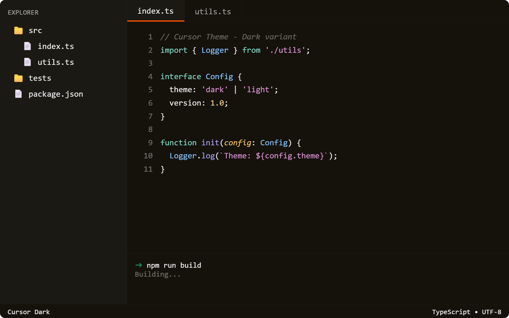
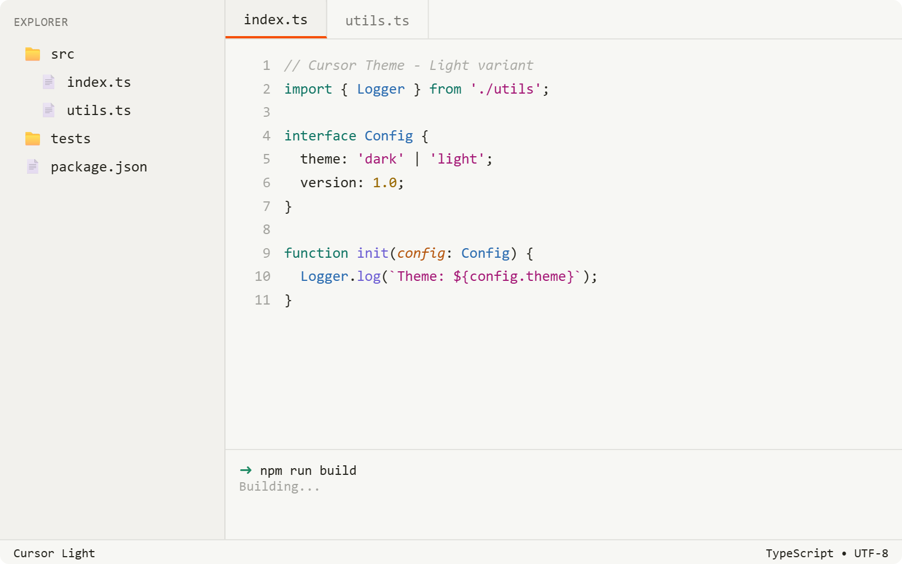

<div align="center">
  
  
  
  
  
</div>

<br />

<div align="center">
  
  <h1>Orangesor</h1>
  <p><strong>Orange-accented color theme for VS Code and Cursor</strong></p>
  <p>Warm, accessible dark and light variants with a signature orange accent (<code>#F54E00</code>).<br />WCAG AA compliant. Optimized for Cursor AI interface surfaces.</p>
</div>

<br />

---

## 📦 Install

### VS Code Marketplace / Cursor Extensions

```bash
# Open Extensions (Ctrl+Shift+X / Cmd+Shift+X)
# Search "Orangesor"
# Click Install
```

Then select **Preferences: Color Theme** → **Orangesor Dark** or **Orangesor Light**.

### VSIX (Manual Install)

1. Download the latest `.vsix` from [GitHub Releases](https://github.com/kleosr/cursor-theme/releases)
2. Command Palette → **Extensions: Install from VSIX...**
3. Choose the downloaded file
4. Select the theme from **Preferences: Color Theme**

## 🚀 Usage

Open the Command Palette (`Ctrl+Shift+P` / `Cmd+Shift+P`) and run **Preferences: Color Theme**. Choose **Orangesor Dark** or **Orangesor Light** to apply.

## 🎨 Themes

### Orangesor Dark

Dark theme with brownish-black background (<code>#14120B</code>) and orange accent (<code>#F54E00</code>).



### Orangesor Light

Light theme with warm beige background (<code>#F7F7F4</code>) and orange accent (<code>#F54E00</code>).



## ✨ Features

- **Dual variants** — dark and light themes with a consistent warm orange accent
- **Comprehensive workbench theming** — sidebar, panels, tabs, activity bar, status bar, and more
- **Rich syntax highlighting** — 30+ token groups covering major languages, markdown, diffs, template literals, regex, and operators
- **Source control graph** — full scmGraph colors in both themes
- **Bracket highlighting** — matching bracket pair colors
- **ANSI color mapping** — semantically correct terminal colors
- **Cursor AI optimized** — polished for Cursor AI interface surfaces
- **WCAG AA compliant** — all critical text pairs meet 4.5:1 minimum contrast ratio

## 🏗️ Architecture

```
orangesor-cursortheme/
├── themes/
│   ├── cursor-dark.json      # Dark variant token colors
│   └── cursor-light.json     # Light variant token colors
├── images/
│   ├── icon.png               # Extension icon
│   ├── cursor-dark-preview.png
│   └── cursor-light-preview.png
├── package.json               # Extension manifest
├── CHANGELOG.md               # Release history
├── LICENSE                    # MIT
└── README.md
```

## 🔧 Development

```bash
git clone https://github.com/kleosr/cursor-theme.git
cd cursor-theme
```

Edit the JSON files in <code>themes/</code> to adjust colors. Test your changes by pressing <code>F5</code> in VS Code to launch an Extension Development Host window, then select the theme.

### Building the VSIX

```bash
npm install -g @vscode/vsce
vsce package
# Output: orangesor-<version>.vsix
```

## 🤖 Integration

Designed for both VS Code and Cursor. The theme surfaces clean contrast and warm accents across all editor chrome — particularly important for AI chat panels, diff views, and inline suggestions in Cursor.

Built with [Cursor](https://cursor.com).

## 📄 License

MIT. See [LICENSE](LICENSE).
